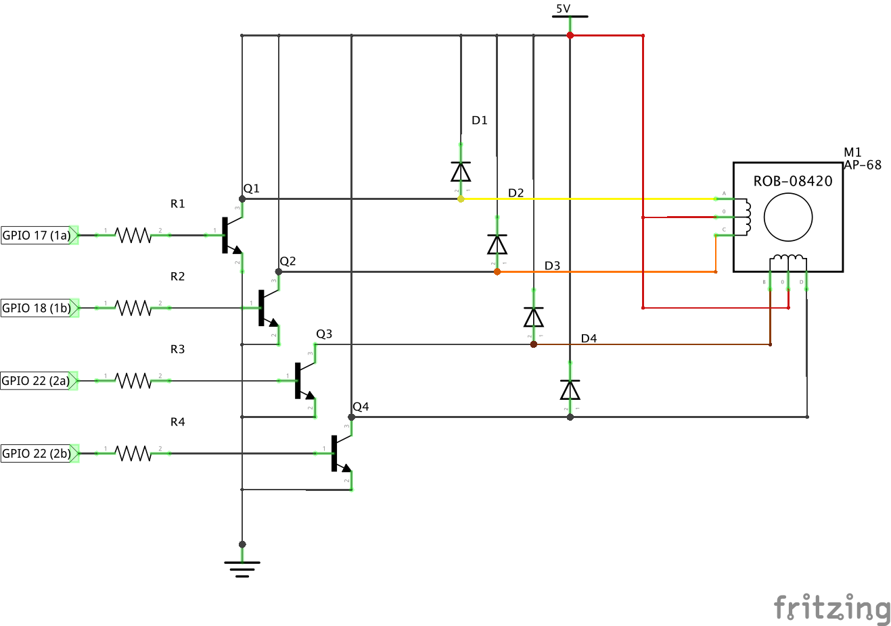

Using a Raspberry Pi (Model B Rev 2) to drive a AP-68 stepper motor.

## AP-68 Stepper Motor Specs

    Description      Brass sleeve bearings
    Voltage Rating   12V
    Phases           4
    Resistance       33Ω
    Number of Leads  6
    Step Angle       1.8°
    Size             68 Dia, 25 L [mm] (with shaft)
    Shaft            6 dia, 10 L [mm]
    Weight           177 Grams

## Setup

## Schema

## Driver Circut

    
## Run

First install the package with `npm i` then run it!

Turn 90° using full stepping with a step delay of 100 milliseconds 

    `sudo node steps.js 90 full 100 false`
    
Turn 180° using full stepping with a step delay of 100 milliseconds 

    `sudo node steps.js 108 half 50 false`
    
See first-steps.js for usage and details.

