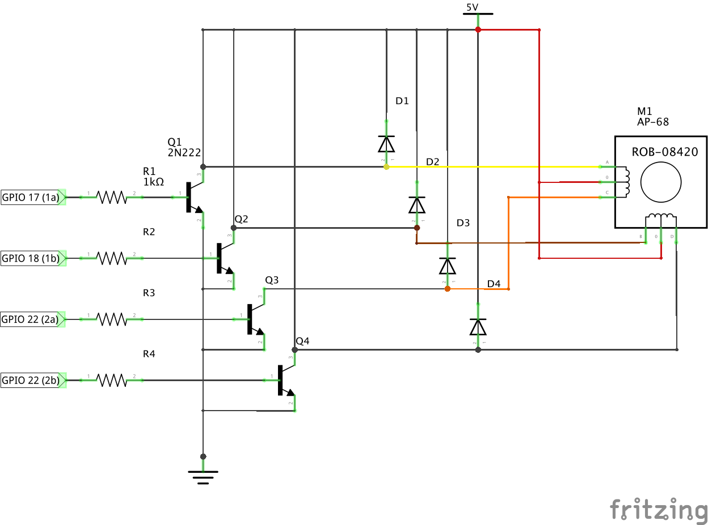
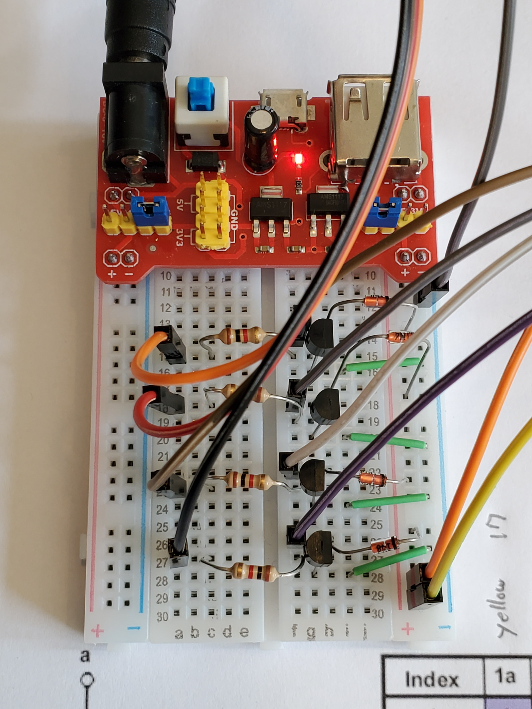

Using a Raspberry Pi (Model B Rev 2) to drive a AP-68 stepper motor.

## AP-68 Stepper Motor Specs

    Description      Brass sleeve bearings
    Voltage Rating   12V
    Phases           4
    Resistance       33Ω
    Number of Leads  6
    Step Angle       1.8°
    Size             68 Dia, 25 L [mm] (with shaft)
    Shaft            6 dia, 10 L [mm]
    Weight           177 Grams

## Setup

## Schematic

## Driver Circut

## Run

First ensure [Pigpio](http://abyz.me.uk/rpi/pigpio/) is installed.

Then install the dependencies with `npm i`

Now you should be ready to run it!

Turn 90° using full stepping with a step delay of 100 milliseconds 

    sudo node first-steps.js 90 full 100 false
    
Turn 180° using full stepping with a step delay of 50 milliseconds 

    sudo node first-steps.js 180 half 50 false
    
See first-steps.js for usage and details.

### Troubleshooting

`pigs-steps.sh` is a simple script of Pigpio pigs cmds to spin the stepper motor.

    sudo pigpiod            # start the pigpiod daemon
    pigs-steps.sh           # spin the motor 360°
    sudo killall pigpiod    # shutdown the pigpiod daemon

